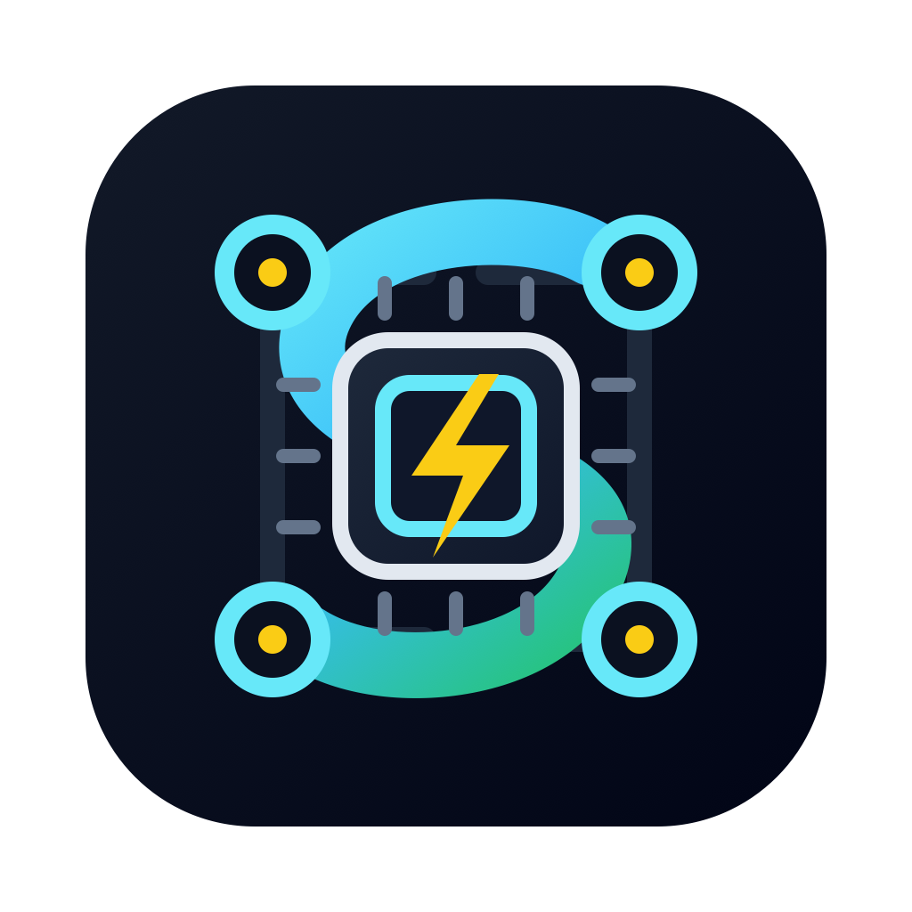

# SLURM Cluster Manager

**Manage, monitor, and submit SLURM jobs directly from VS Code.**

This extension bridges the gap between your editor and your compute cluster. Visualise job progress, inspect output files on the fly, and manage your workflow without context switching to a terminal.

## Key Features

### 🚀 Active Job Management
- **Real-time Monitoring**: View all your jobs (Running, Pending, Held) in a dedicated sidebar.
- **Visual Progress**: Smart progress bars show time usage at a glance (`Elapsed / Time Limit`).
- **Resource Stats**: See allocated CPUs, memory, and nodes.
- **GPU Visibility**: Integrates with `nvidia-smi` to show GPU memory and utilization where available.
- **One-Click Actions**: Cancel, hold, or pin jobs directly from the UI.

### 📜 Job History & Logs
- **Integrated History**: Browsable history of your completed, failed, or cancelled jobs (default: last 7 days).
- **Instant Log Access**: Right-click any job (active or historical) to immediately open its `stdout` or `stderr` files.
- **Smart Path Resolution**: automatically detects output log paths from `scontrol` and `sbatch` definitions.

### 🔌 Seamless Workflow
- **Pinning**: "Pin" critical long-running jobs to keep them in view, even if you filter or sort the list.
- **Search & Filter**: Quickly find specific jobs by name.

## Configuration

Customize the extension in VS Code Settings (`Cmd+,`):

| Setting | Default | Description |
|:--------|:--------|:------------|
| `autoRefreshInterval` | `30` | Refresh frequency in seconds (5s - 1h). |
| `autoRefreshEnabled` | `false` | specific whether to auto-start refreshing on window load. |
| `confirmCancelJob` | `true` | Prevent accidental cancellations with a confirmation prompt. |

## Requirements

This extension assumes it is running in an environment with access to standard SLURM commands:
- `squeue`
- `scontrol`
- `sacct`
- `sbatch`
- `scancel`

> **Note:** If you are using VS Code Remote - SSH, install this extension on the **Remote** target, not locally.

## License

[MIT](LICENSE)