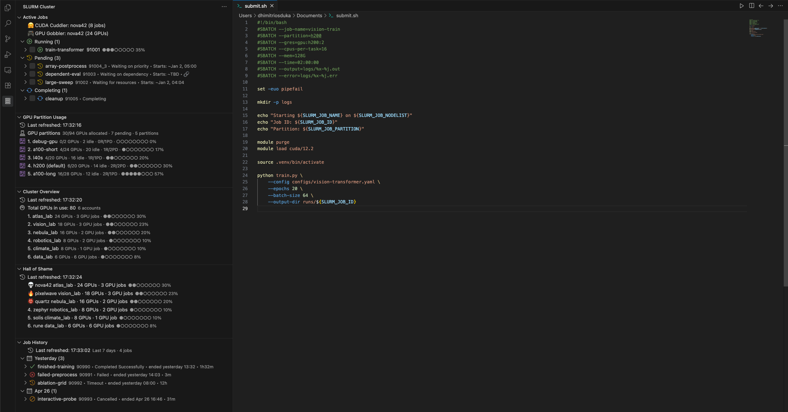
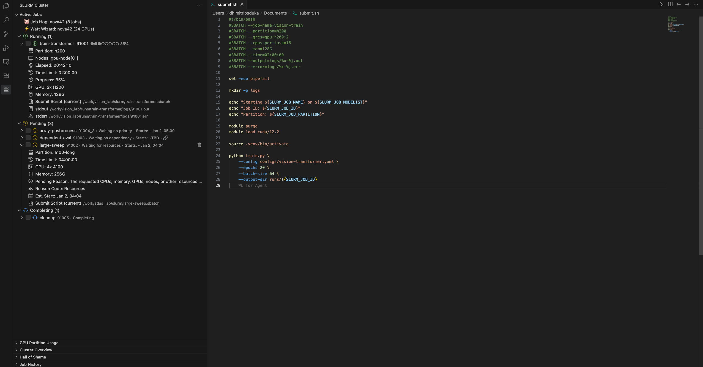
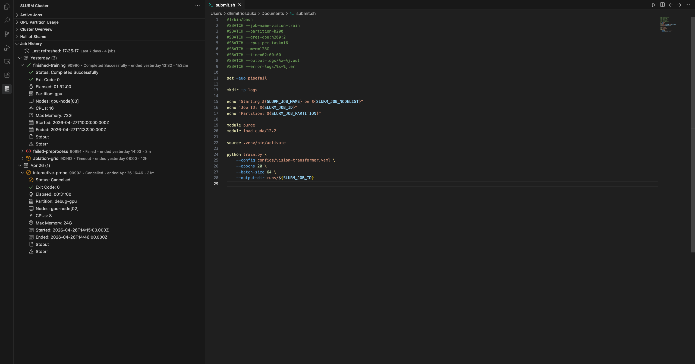
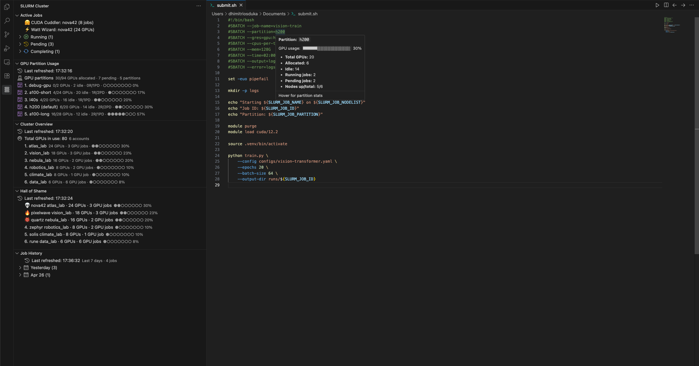

# SLURM Cluster Manager

**Manage, monitor, and submit SLURM jobs directly from VS Code.**

SLURM Cluster Manager brings your HPC workflow into your editor: monitor jobs in real time, inspect logs instantly, compare GPU usage, and take common actions (cancel/pin/submit) without context-switching to a terminal.

---

## ✨ Highlights

- **Live job monitoring** in a dedicated sidebar (Running / Pending / Completing / Job History)
- **Visual progress bars** for time usage (`Elapsed / Time Limit`)
- **GPU Partition Usage** so you can compare partitions before submitting
- **Cluster Overview** showing which Slurm accounts are using the most GPUs
- **GPU stats** via `nvidia-smi` (when available)
- **One-click actions**: cancel, cancel pending jobs, batch cancel, pin
- **Job History** grouped by date with configurable lookback range
- **Instant log access** for `stdout` / `stderr`

---

## 🚀 Features

### Active Job Management
- **Real-time Monitoring**: View all active jobs at a glance (Running, Pending, Completing, and other active states).
- **Time Awareness**: Smart progress bars show elapsed vs. requested wall time.
- **Resource Stats**: Display allocated CPUs, memory, and node count for each job.
- **GPU Visibility**: Uses `nvidia-smi` to surface GPU utilization and memory usage where supported.
- **One-Click Actions**: Cancel or pin jobs directly from the UI.
- **Batch Cancel**: Select multiple jobs via checkboxes, then cancel them all at once. The "Cancel All" button becomes "Cancel Selected" when jobs are checked. Selections persist across refreshes.
- **Pending Cleanup**: Cancel all pending jobs without stopping jobs that are already running.
- **Smart Pending Display**: Pending jobs hide irrelevant info (Nodes, Elapsed, logs) and instead show human-readable pending reasons, estimated start time, and dependency indicators (🔗).
- **Job Dependencies**: View dependency info (e.g., `afterok:12345`) in the expanded job details.

### Job Array Management
Smart handling of SLURM job arrays with flexible cancellation options:
- **Cancel entire array**: Remove all jobs in the array at once
- **Cancel pending jobs**: Cancel only pending jobs, keep running ones
- **Cancel specific job(s)**: Flexible input supporting:
  - Single index: `3`
  - Range: `0-10` (indices 0 through 10 inclusive)
  - Step: `0-20:2` (every 2nd job: 0, 2, 4, ..., 20)
  - List: `1,3,5,7` (non-contiguous jobs)
- **Bounds validation**: Automatically validates against actual array range
- **Safety warnings**: Extra confirmation when cancelling >100 jobs

> **Note:** Array-level cancel options only appear for pending jobs. Running array tasks are cancelled directly like any individual job.

### Job History & Logs
- **Integrated Job History**: Browse recent completed, failed, and cancelled jobs (default: last 7 days).
- **Date Grouping**: Jobs are grouped by completion date with compact elapsed-time and end-time labels.
- **Job History Range Control**: Use the toolbar action to switch between common lookback windows or enter a custom range.
- **Refresh Awareness**: Job History includes a "last refreshed" row so you know when the data was fetched.
- **Instant Log Access**: Right-click any job (active or historical) to open its `stdout` / `stderr`.
- **Smart Path Resolution**: Automatically resolves log locations from `sbatch` directives and `scontrol` metadata, including relative paths, `~`, Slurm filename placeholders, array IDs, escaped spaces, and unavailable paths like `(null)`.

### GPU Partition Usage
- **GPU-only Partition View**: A dedicated sidebar view shows only partitions that advertise GPUs through Slurm GRES.
- **Least-used First**: Rows are sorted from least used to most used by allocated GPU share, then pending-job pressure, idle GPUs, running jobs, and name.
- **Available vs. Total GPUs**: Rows distinguish available GPUs from total GPUs so down/draining nodes do not make a partition look more usable than it is.
- **Queue Pressure**: Running and pending job counts are shown per GPU partition, including pending jobs that target multiple partitions.
- **GPU Type Breakdown**: Hover a partition row to see GPU types and capacity, such as `a100`, `h200`, or generic GPUs.
- **Manual refresh only**: The view fetches data when opened or manually refreshed, avoiding background load on the Slurm controller.

### Workflow Integrations
- **Pinning**: Keep critical long-running jobs visible even while filtering or sorting.
- **Search & Filter**: Quickly find jobs by name.
- **Cluster Hog Indicators**: Two fun indicators at the top of your job list:
  - **Job Hog**: The user with the most running jobs (🐷 Job Hog, 🔥 Cluster Dominator, 🤗 CUDA Cuddler, 😋 Node Nom-Nom)
  - **GPU Hog**: The user hoarding the most GPUs (🧛 VRAMpire, 🎮 GPU Gobbler, ⚡ Watt Wizard, 🏋️ Tensor Titan)

### Hall of Shame
- **Hall of Shame**: A dedicated sidebar view ranking GPU users by allocated GPUs and running GPU job count.
- **GPU-only rankings**: CPU-only jobs and CPU-only users are excluded from the Hall of Shame.
- **Slurm account context**: Rows show the Slurm account responsible for the GPU jobs, with all accounts listed in the tooltip when a user has jobs under multiple accounts.
- **GPU type breakdown**: Hover a row to see how many GPUs are allocated by type, such as `a100`, `h200`, or generic GPUs.
- **Cluster GPU share**: Rows show a progress bar for how much of the currently allocated cluster GPU pool each user is holding.
- **Configurable size**: Use the Hall of Shame toolbar action or `leaderboardTopUserCount` setting to choose how many top GPU users to show.
- **Manual refresh only** — no background polling, so it won't add load to your cluster.
- **Last refreshed timestamp**: Shows when the Hall of Shame data was fetched so stale data is easy to spot.
- **Your row stays visible**: Your own Hall of Shame row is highlighted and shown even when you're outside the configured top count.
- Top 3 hogs get shame emojis: 💀 🔥 👹

### Cluster Overview
- **Account-level GPU Usage**: A dedicated sidebar view shows which Slurm accounts are using the most GPUs.
- **GPU-only accounting**: CPU-only jobs are excluded so the view stays focused on GPU pressure.
- **Top users per account**: Hover an account row to see the heaviest users under that account.
- **GPU type breakdown**: Tooltips show how each account's GPU allocation is distributed by GPU type.
- **Cluster share bars**: Rows show each account's share of currently allocated GPUs as a compact progress bar.
- **Last refreshed timestamp**: Shows when the Cluster Overview was fetched.

### Script Intelligence
- **Quick Submit**: A ▶ button appears in the editor title bar when viewing any file containing `#SBATCH` directives. One click to submit — no dialogs.
- **Partition Hover Stats**: Hover over a partition name in `#SBATCH --partition=` to see real-time GPU usage, running/pending jobs, and node availability with a visual usage bar.
- **Visual Hints**: Partition names get a dotted underline to show they're hoverable.

---

## ⚙️ Configuration

Configure the extension via **VS Code Settings** (`Cmd+,` on macOS / `Ctrl+,` on Windows/Linux):

| Setting | Default | Description |
|---|---:|---|
| `autoRefreshInterval` | `30` | Refresh frequency (in seconds). Range: **5s → 1h** |
| `autoRefreshEnabled` | `false` | Auto-start refreshing on window load |
| `confirmCancelJob` | `true` | Ask for confirmation before cancelling a job |
| `leaderboardTopUserCount` | `10` | Number of top GPU users to show in the Hall of Shame |

> Tip: If you monitor many jobs, increasing `autoRefreshInterval` reduces SLURM command load.

---

## ✅ Requirements

This extension **must run on a machine with direct access to SLURM commands**.  
In practice, that means you should install it **only on the cluster side** (e.g., a login node / head node / SLURM-accessible node — whichever your site provides), not on your local computer.

Required commands:
- `squeue`
- `sinfo`
- `scontrol`
- `sacct`
- `sbatch`
- `scancel`

GPU Partition Usage requires GPU partitions to be exposed through Slurm GRES (`sinfo %G`). If your cluster tracks GPUs outside GRES, those partitions may not appear in the GPU Partition Usage view.

### Important: No Remote Connection (Yet)
At the moment, the extension **cannot connect to a remote cluster by itself**.
It does **not** SSH into a server, tunnel commands, or forward SLURM calls.

✅ **Supported setup:** Run VS Code *on the SLURM-accessible node* (or use **VS Code Remote - SSH** to open a remote VS Code session on that node) and install the extension **on the Remote target**.

🚧 **Remote connection support is work-in-progress (WIP)** and will be added in a future release.

---

## 🤝 Contributing

Contributions are welcome — bug fixes, documentation improvements, and feature requests.

- Report issues / request features: https://github.com/dhimitriosduka1/sCode/issues  
- Pull requests are welcome!

If you’re opening a PR, please include:
- A short description of the change and why it helps
- Screenshots/GIFs for UI updates (when applicable)

---

## 📄 License

MIT — see [LICENSE](LICENSE).

---

  If this extension helps you, consider giving it a ⭐ on <a href="https://github.com/dhimitriosduka1/sCode">GitHub</a>!

  Made with ❤️ by <a href="https://github.com/dhimitriosduka1">Dhimitrios Duka</a> with <b>Google Antigravity</b>

