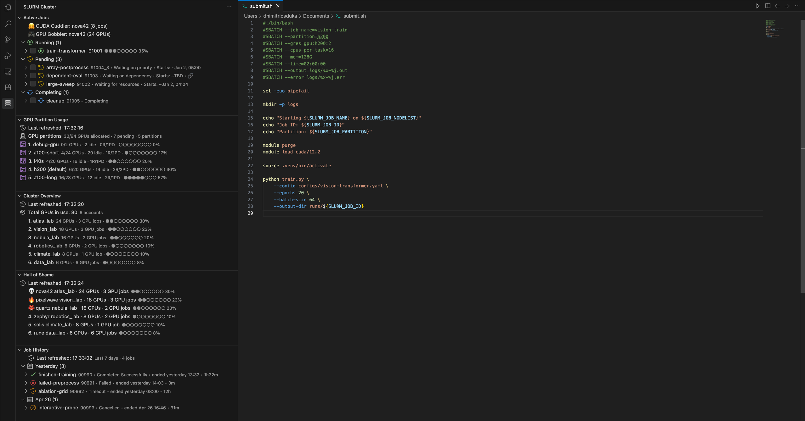
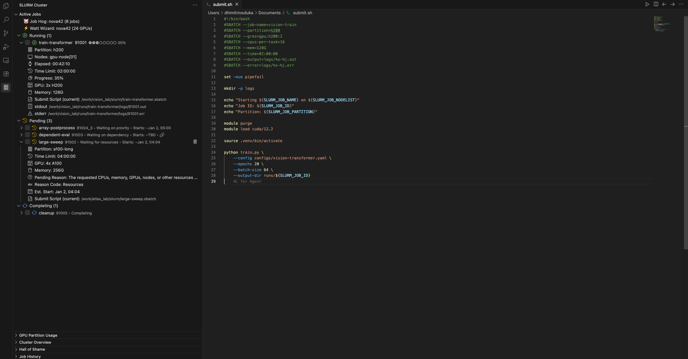
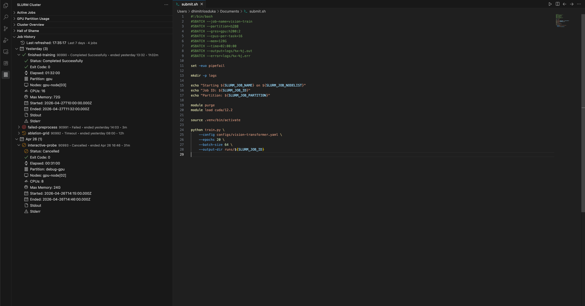
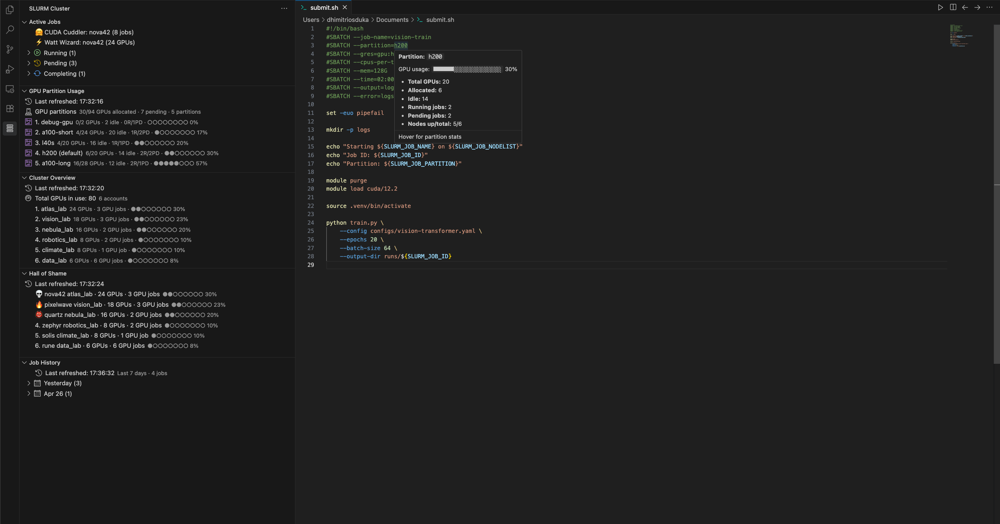

  

<h1 align="center">SLURM Cluster Manager</h1>

  <b>Monitor, submit, and manage Slurm jobs without leaving VS Code.</b>

  
  
  
  
  
  

  <a href="#getting-started">Getting started</a> ·
  <a href="#features">Features</a> ·
  <a href="#configuration">Configuration</a> ·
  <a href="#how-it-uses-your-cluster">Cluster load</a> ·
  <a href="#troubleshooting">Troubleshooting</a>

SLURM Cluster Manager brings your cluster workflow into the editor. Follow running jobs, open their logs, compare partition availability, and check GPU requests before submitting—all from the VS Code sidebar and script editor.

## Highlights

- **Follow every job.** See job states, elapsed time, pending reasons, and estimated start times.
- **Open logs in a click.** Access stdout and stderr from active jobs and job history.
- **Choose a suitable partition.** Compare GPU availability and get partition suggestions as you write a script.
- **Catch GPU mismatches early.** Get warnings when a requested GPU type is unavailable in the selected partitions.
- **Understand your priority.** Inspect your fair share and the priority components of pending jobs.
- **Manage jobs from the sidebar.** Cancel, hold, release, update dependencies, and adjust job array concurrency.

## Getting started

1. **Connect to your cluster.** Use [Remote - SSH](https://code.visualstudio.com/docs/remote/ssh) in VS Code to connect to your cluster’s node, then open the folder containing your job scripts.

2. **Install the extension on the cluster.** In the connected VS Code window, open **Extensions**, search for **SLURM Cluster Manager**, and install it on the **SSH host**. You can also find it on the [VS Code Marketplace](https://marketplace.visualstudio.com/items?itemName=DhimitriosDuka.slurm-cluster-manager) or [Open VSX](https://open-vsx.org/extension/DhimitriosDuka/slurm-cluster-manager).

3. **Open the SLURM sidebar.** Click **SLURM Cluster** in the Activity Bar on the left. **Active Jobs** shows your running and queued jobs; **GPU Partition Usage** helps you compare partitions before submitting.

4. **Submit a script.** Open a script containing `#SBATCH` directives, save your changes, and click **▶** in the editor title bar. To make the new job wait for another job, use the adjacent **link icon** to choose a dependency instead.

5. **Follow your job.** Find it in **Active Jobs** and expand it to inspect its status and resources. Once it starts, click **stdout** or **stderr** to open its logs. Use the **refresh button** for an update, or the **watch icon** to enable automatic refresh. Finished jobs appear in **Job History**.

## Features

### Active jobs

Jobs are grouped by state, with progress bars showing elapsed time against the requested time limit. Pending jobs show readable reasons such as “Waiting for resources,” estimated start times when available, and dependency indicators.

- **Inspect details:** Expand a job for its partition, resources, time limit, dependencies, and available logs.
- **Find jobs:** Search by name, job ID, or pending reason.
- **Cancel jobs:** Cancel one job, checked jobs, all active jobs, or just the running or pending group.
- **Hold and release:** Pause pending jobs or make them eligible to run again, individually or in bulk.
- **Update dependencies:** Change or clear a pending job’s dependency.
- **Copy IDs:** Copy a job ID; for arrays, the action copies the base array ID.
- **Review scripts:** Open the current submit script and, when available, a copy saved when the extension first reads it for that job. The copy preserves the file at that point; it may differ from the version originally submitted to Slurm.

### Job arrays

Control arrays without entering commands in a terminal:

- Cancel an entire array, only its pending tasks, or specific indices: `3`, `0-10`, `0-20:2`, or `1,3,5`.
- Validate selected indices against the array’s bounds, with an extra confirmation when cancelling more than 100 tasks.
- Change the maximum number of tasks allowed to run at once.

Array cancellation options appear on pending array entries. Running tasks are cancelled individually like other running jobs.

### Job history and logs

Browse completed, failed, timed-out, and cancelled jobs, grouped by day. The default range is **7 days**; choose 1 day, 30 days, or a custom lookback from the toolbar. Search by name or job ID and page through longer histories.

Expand a job to see its exit code, partition, nodes, CPUs, peak memory when reported, and start and end times. Open available stdout and stderr files directly from the job’s details.

For running jobs, **Open Stdout and Stderr Side by Side** opens both logs in a split editor. If both streams use the same file, it opens once.

Log paths are resolved from Slurm metadata and cached paths, including relative paths, `~`, filename placeholders such as `%j` and `%a`, and array task IDs. Historical paths depend on what the extension cached or Slurm still retains.

### Submit script assistance

- **Partition suggestions:** Complete partition names with load and idle capacity alongside them. GPU partitions appear first, with each group ordered by load. Partitions matching the script’s requested GPU types are prioritised.
- **GPU type suggestions:** Get GPU types and idle counts for the selected partitions in `--gres=gpu:`, `--gpus`, `-G`, `--gpus-per-node`, `--gpus-per-task`, and `--gpus-per-socket` options.
- **GPU compatibility warnings:** See an underline when a requested GPU type is absent from the selected partitions, or when a GPU request targets a partition without GPUs.
- **Partition details on hover:** Inspect GPU or CPU capacity, load, jobs, and nodes. The panel includes the data’s age, a refresh action, and a notice for unknown partition names.
- **Editor submission:** Submit the saved script with **▶**, or use the dependency button to choose prerequisite jobs and dependency types.

Partition completion supports `#SBATCH -p` and `--partition=`, unambiguous abbreviations such as `--part=`, options on `srun`/`salloc`/`sbatch` lines, partition environment variables, and comma-separated lists such as `-p a100,h200`.

> **No suggestions inside `#SBATCH` comments?** Press `Ctrl+Space` to open the completion list.

### GPU partition usage

The **GPU Partition Usage** view ranks partitions by allocated GPU share, with queue pressure and idle capacity helping distinguish similarly loaded partitions.

Expand a partition for allocated, idle, available, and total GPU counts, GPU types, node states, and running and pending jobs. Load is measured against **usable capacity**, so down or draining nodes do not make a partition appear less busy.

Partition data refreshes at startup and every **5 minutes** by default. Use the refresh button for an immediate update, or the watch icon to change or disable the interval. Script suggestions, hovers, and warnings share this data.

Use these figures to compare current availability; actual start times also depend on job requirements and cluster scheduling policies.

### Fair share and priority

The top of **Active Jobs** shows your fair share factor, for example `⚖️ Your fair share: 0.214`. With Fair Tree, a higher factor indicates a stronger fair share standing. It is one component of [Slurm’s job priority calculation](https://slurm.schedmd.com/priority_multifactor.html), not a queue position or start-time estimate.

Fair share is tracked per account. The view prioritises an account used by your active jobs, then your default account when available. Hover the row to inspect all your accounts.

Hover a pending job to see its weighted fair share, age, QOS, partition, and job size contributions, with the largest displayed contribution identified.

These details require Slurm accounting and the multifactor priority plugin. Disable them with `slurmClusterManager.showFairShare`.

### Cluster activity and maintenance

- **Cluster Overview:** Compare Slurm accounts by allocated GPUs, GPU types, and share of the allocated GPU pool. Hover an account to see its top users.
- **Hall of Shame:** View users ranked by allocated GPUs, with account details, GPU types, cluster share, and fair share when available. The top three get 💀 🔥 👹, and your own row remains visible even outside the configured top count.
- **Resource hog indicators:** See the biggest job and GPU users at the top of Active Jobs, with titles such as 🐷 Job Hog and 🧛 VRAMpire. Hide them with `slurmClusterManager.showResourceHogs`.
- **Maintenance warnings:** Active Jobs, GPU Partition Usage, and Cluster Overview show upcoming or active reservations flagged `MAINT`, with affected nodes and times on hover.

Cluster Overview and Hall of Shame fetch data on first opening or explicit refresh and display when they were last updated.

## Configuration

Open **Settings** (`Cmd+,` on macOS or `Ctrl+,` on Windows/Linux) and search for **SLURM Cluster Manager**.

All settings below use the `slurmClusterManager.` prefix, for example `slurmClusterManager.autoRefreshEnabled`.

| Setting | Default | Description |
| --- | --- | --- |
| `autoRefreshEnabled` | `false` | Automatically refresh Active Jobs and Job History. |
| `autoRefreshInterval` | `30` | Seconds between job refreshes, from `5` to `3600`. |
| `partitionRefreshInterval` | `5` | Minutes between partition refreshes; `0` disables background refresh. Maximum: `120`. |
| `confirmCancelJob` | `true` | Ask before cancelling a job. |
| `submitDependencyBehavior` | `"prompt"` | Currently has no effect. Use the editor’s dependency button to submit with dependencies. |
| `showFairShare` | `true` | Show fair share and pending-job priority details. |
| `showResourceHogs` | `true` | Show the biggest job and GPU users in Active Jobs. |
| `leaderboardTopUserCount` | `10` | Number of top users in Hall of Shame, from `1` to `100`. Your own row remains visible. |
| `showOpenLogsSideBySideButton` | `true` | Show the split-log button on active jobs. The action remains in the context menu when hidden. |
| `openLogFileInPreview` | `true` | Open logs in reusable preview tabs. Set to `false` for permanent tabs. |
| `mockMode` | `false` | Use built-in sample data without Slurm. |

## How it uses your cluster

The extension runs Slurm commands on the host where it is installed and shares cached data between views where possible.

| Feature | When it queries Slurm |
| --- | --- |
| Active Jobs and Job History | When views need data, on refresh, and after relevant job actions. Optional auto-refresh defaults to every 30 seconds and is off initially. Expanding a historical job may also query its log paths. |
| Partition data | At startup, on manual refresh, and every 5 minutes by default. Suggestions, hovers, and GPU warnings reuse the shared snapshot. |
| Cluster Overview and Hall of Shame | On first opening or explicit refresh; no periodic polling. |
| Fair share | A shared `sshare` result is cached for 5 minutes. Manually refreshing Active Jobs or Hall of Shame invalidates it. |
| Pending-job priority | `sprio` is queried when pending jobs are loaded and `showFairShare` is enabled. |

Scheduled job and partition refreshes pause while the VS Code window is unfocused. Increase the intervals or disable background refresh to reduce polling.

Commands that change cluster state—such as `sbatch`, `scancel`, and `scontrol hold`, `release`, or `update`—run only when you choose the corresponding action.

## Requirements

- **VS Code 1.85 or newer**, or a compatible editor that supports extensions from Open VSX.
- **Slurm commands available to the extension host.** With Remote - SSH, install the extension on the remote host. The extension does not establish an SSH connection itself.

| Commands | Used for |
| --- | --- |
| `squeue`, `sinfo`, `scontrol` | Jobs, partitions, job details, maintenance, and job updates. |
| `sacct` | Job history. |
| `sbatch`, `scancel` | Job submission and cancellation. |
| `sshare`, `sprio` | Optional fair share and priority details. |
| `sacctmgr` | Optional lookup of your default account for fair share. |

GPU Partition Usage requires GPUs to be configured as Slurm **GRES**, as reported by `sinfo -o %G`.

## Troubleshooting

**Active Jobs says “SLURM not available on this system.”**

Check that `squeue` works on the host running the extension. With Remote - SSH, confirm that the Extensions view lists the extension under **SSH: your-host**. If Slurm was added to your environment after VS Code started, reload the remote window.

**No fair share or priority details appear.**

Enable `slurmClusterManager.showFairShare` and check that your cluster provides `sshare` and `sprio`, Slurm accounting, and the multifactor priority plugin.

**A GPU partition is missing.**

Check whether its GPUs appear in `sinfo -o %G`. The GPU view includes partitions that advertise GPUs through Slurm GRES.

**Partition or GPU suggestions do not appear.**

Press `Ctrl+Space`, especially inside `#SBATCH` comments. Check that the file is recognised as a shell script, plain text, `.slurm`, or `.sbatch`, and refresh GPU Partition Usage if the cluster data is unavailable or stale.

**A job has no stdout or stderr file.**

Pending jobs normally have no output yet. For running or finished jobs, check that the log exists and is accessible from the extension host. Older jobs may lack log links if their paths were never cached and Slurm no longer retains their details.

## Contributing

Bug reports, feature requests, and pull requests are welcome on [GitHub](https://github.com/dhimitriosduka1/sCode/issues). Explain the change and why it helps, and include a screenshot for visual updates.

## Changelog and license

See [CHANGELOG.md](CHANGELOG.md) for release notes. Licensed under the [MIT License](LICENSE).

---

  If this extension helps you, consider giving it a ⭐ on <a href="https://github.com/dhimitriosduka1/sCode">GitHub</a>.
   
  Made with ❤️ by <a href="https://github.com/dhimitriosduka1">Dhimitrios Duka</a>

